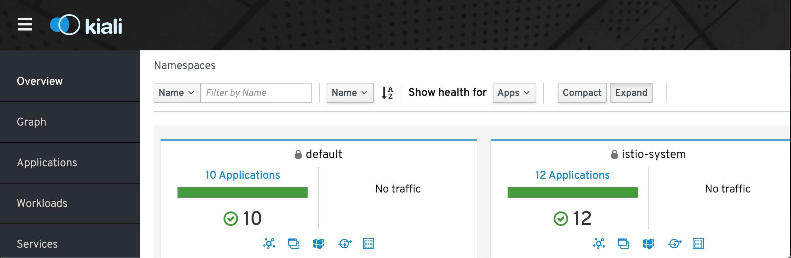

# k8sLevel3
Kubernetes level 3

#### 1. Create a Kubernetes cluster on GCP (GCP gives free credits on signup so those should suffice for this exercise) on their virtual machines (do not use GKE) or use the cluster created in the level2 test. If possible share a script / code which can be used to create the cluster.
Covered this in task 1 of level 2.


### 2. Setup CI Server (Jenkins or tool of your choice) inside the Kubernetes cluster and maintain the high availability of the jobs created.

Using the `jenkins/jenkins-manifest.yaml` file will deploy the Jenkins on kubernetes cluster and credentials will be stored in secrets and could be retrieved using below command.
```bash
    kubectl apply -f jenkins/jenkins-manifest.yaml
```

```bash
    printf $(kubectl get secret cd-jenkins -o jsonpath="{.data.jenkins-admin-password}" | base64 --decode);echo
```
Exposed the Jenkins against a loadbalancer -> `http://104.198.24.162:8080` 

> Note: In `jenkins/jenkins-manifest.yaml` file we are installing kubernetes jenkins plugin by default so that we can run all our jobs within the the kubernetes pod which will be acting as a default slave. 

### 3. Create a namespace & deploy the mediawiki application on cluster
we can leverage Helm to deploy the mediawiki application as the Helm chart for this is readily available

```bash
    kubectl create -f namespace-creation.yaml
    helm install --mediawiki-release \
      --set mediawikiUser=<user>,mediawikiPassword=<password>,mariadb.mariadbRootPassword=<pwd> \
        stable/mediawiki -n mediawiki
```

The above the command will deploy `mediawiki` application with release name `mediawiki-release` inside mediawiki namespace
Exposed the `mediawiki` against a loadbalancer -> http://35.239.75.46/

### 4. Setup private docker registry to store the docker images. configure restricted access between cluster to registry and cluster to pipeline
I'm setting up docker private registry on `CentOS Linux release 7.6.1810 (Core)`. </br>
Prerequisites - ensure you have docker and openssl pre installed
```bash
    mkdir -p /docker_data/certs/
    openssl req -newkey rsa:4096 -nodes -sha256 -keyout /docker_data/certs/domain.key -x509 -days 365 -out /docker_data/certs/domain.crt # provide the Common name when prompted, rest prompts can be left empty.
    mkdir -p /docker_data/images
    docker run -d -p 5000:5000 \
    -v /docker_data/images:/var/lib/registry \
    -v /docker_data/certs:/certs \
    -e REGISTRY_HTTP_TLS_CERTIFICATE=/certs/domain.crt \
    -e REGISTRY_HTTP_TLS_KEY=/certs/domain.key \
    --restart on-failure \
    --name myregistry \
    docker.io/registry
    #for testing pull and push the image to newly created registry
    docker pull nginx
    docker tag docker.io/nginx localhost:5000/my-nginx
    docker push localhost:5000/my-nginx
```
> Note: we might have to add the `localhost:5000` to Insecure Registry for docker engine

we can connect to docker-private registry from the docker-client (it should be accessible from docker-registry server) using the domain.crt that we created above using openssl. <br/>
Make sure docker is pre installed on docker-client and domain.crt created above is copied to docker-client as well and then create a tag or build the image using the `Common name` provided above.
`Docker clients would use this TLS certificate to avoid certificate issues`
 ```bash
    mkdir -p /etc/docker/certs.d/<Common name>:5000/
    # copy the domain.crt from docker-registry server to docker-client to newly created directory as mentioned above
    docker tag docker.io/nginx <Common name:5000>/my-nginx
    docker push <Common name:5000>/my-nginx
```   

### 5. Deploy an open source vulnerability scanner for docker images scanning within the CI build pipeline.

Anchore Engine is a tool for analyzing container images. In addition to CVE-based security vulnerability reporting, Anchore Engine can evaluate Docker images using custom policies. </br>
leveraging the helm chart available for `Anchore` for installing the `Anchore engine`
```bash
    helm install --name <release_name> -f anchore_values.yaml stable/anchore-engine
```
Exposed the Anchore against a loadbalancer -> `http://35.224.242.72:8228/` 

once the anchore engine is installed on kubernetes we can either use the Anchore load balancer or svc endpoint for scanning docker images for vulnerability.

Using the declarative pipeline, configured the jenkins CI for docker build & anchore scanning.
> Note : I am using the jenkins kubernetes plugin so that kubernetes pod can behave as jenkins slave, Declarative pipeline code is checked-in under `Jenkinsfile` available in the jenkins directory of this repo.

### 6. Setup Nginx Ingress Controller manually. Configure proper routes between ingress and the application.
Covered this in task 2 of level 1.


### 7. Setup Istio and configure Kiali & Zipkin.
I'm using the official [istio release](https://github.com/istio/istio/releases) to download the latest istio package i.e. Istio 1.2.0
Extract the downloaded installation file.
Ensure that you're in the Istio installation's root directory.

Install Istio's core components:
```bash
    kubectl apply -f install/kubernetes/istio-demo-auth.yaml
```

> By default this come with zipkin and kiali, we can use port forward to access them.
for e.g. kiali refer the below screenshot
 


### 8. Setup mTLS authentication between microservices. Use self-signed certificates for secure communication between microservices.
Prerequisites - Please make sure nginx ingress controller is installed in the cluster(Covered this in task 2 of level 1.)
In order to setup Mutual Authentication we need to perform a couple of steps.

creating the self-signed certificate
```bash
    sh ./mtls_auth/cert-2048.sh
```
storing the certificates generated above in a Kubernetes Secret
```bash
    kubectl create secret generic my-certs --from-file=tls.crt=server.crt --from-file=tls.key=server.key --from-file=ca.crt=ca.crt
```
Deploying application that just responds with information about the request
```bash
    kubectl apply -f ./mtls_auth/deployment.yaml
    kubectl apply -f ./mtls_auth/ingress.yaml
    kubectl apply -f ./mtls_auth/service.yaml
```

for testing Sending a request with the Client Certificate and Key, should redirect you to the `mstakx-svc` if the certificates are not provided while calling the request then it will return `400 bad request`
for e.g. `curl <url> --cert client.crt --key client.key -k ` use the same url as per configured in ingress

### 9. Setup Kubernetes Dashboard and secure access to the dashboard using a read only token.
Leveraging the helm chart available for kubernetes dashboard 

````bash
    helm install --name k8s-dashboard -f k8s_dashboard/k8s-dashboard-custom-values.yaml stable/kubernetes-dashboard
````

while installing the kubernetes dashboard's helm chart you might encounter the access issue for kubernetes dashboards service account similar to below provided
`panic: secrets is forbidden: User "system:serviceaccount:default:k8s-dashboard-kubernetes-dashboard" cannot create resource "secrets" in API group "" in the namespace "kube-system"` 
To resolve this we can us any of the below methods
* create cluster role binding and assign the k8s dashboard service account to it (Not advisable for production).
* we can create separate service account instead of using the kubernetes dashboard's service account.
 
> Note: we can limit the role for  service account to pods & namespace or read access 0nly if required


### 10. Automate the process of cluster creation and application deployment using Terraform + Ansible/Jenkins/Helm/script/SDK.
I have covered the GKE cluster creation using terraform in task 1 of level 1. </br>
For application deployment say guestbook could be easily done using the kubernetes module available in terraform. </br>
Before we start, we need to initialize some variables that the GCP provider requires & administrative account and a random password for the cluster. </br>
we would require four files for kubernetes also checked in under terraform-gke directory i.e. 
```text
    ├── k8s
    │   ├── k8s.tf
    │   ├── pods.tf
    │   ├── services.tf
    │   └── variables.tf
```
Install the cluster & Launch the Application
```bash
    terraform init
    terraform plan
    terraform apply
    kubectl get service --watch #after couple of minutes you will be able to see the endpoints
```
> Note: the latest version of terraform i.e. [0.12](https://www.hashicorp.com/blog/announcing-terraform-0-12) might not support the labels and selector block for kubernetes as supported by 0.11 so we might need to do some changes to make it work on the latest release